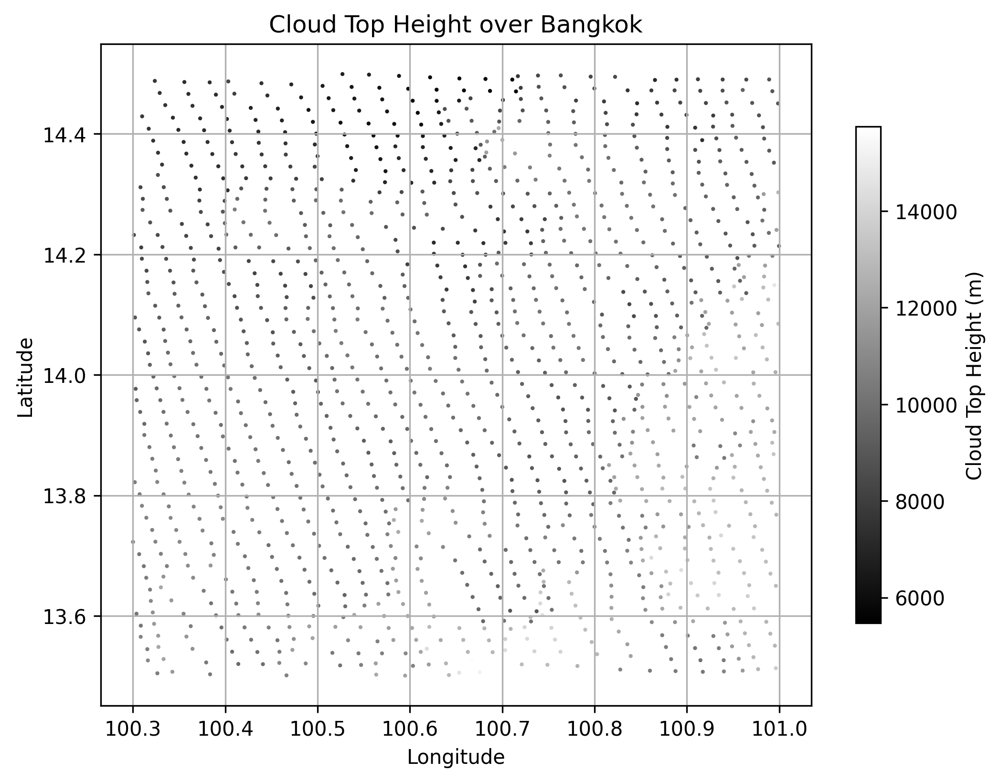
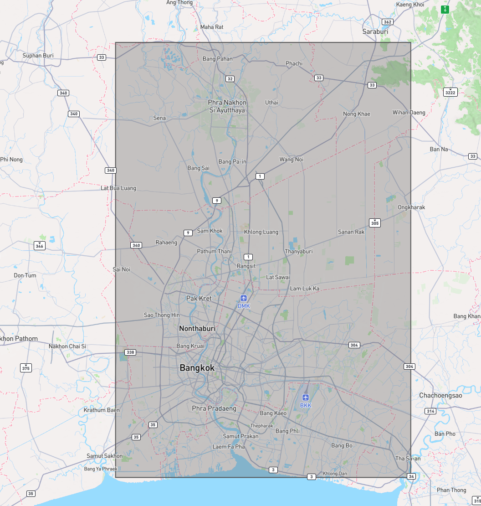

### **this repo contains Various method to getting a weather data to train an AI for project FloodMai of Super AI innovator**

- `3hour_fetch.py` : Getting a data from `https://data.tmd.go.th/api/Weather3Hours/V2/?uid=api&ukey=api12345` for Bangkok area every 3 hours (1AM,4AM and forward) and save it into a csv.

Example data:
| DateTime           | StationID | StationName         | Province       | Latitude | Longitude | StationPressure | MeanSeaLevelPressure | AirTemperature | DewPoint | RelativeHumidity | VaporPressure | LandVisibility | WindDirection | WindSpeed | Rainfall | Rainfall24Hr |
|--------------------|-----------|----------------------|----------------|----------|-----------|------------------|------------------------|----------------|----------|------------------|----------------|----------------|----------------|-----------|----------|---------------|
| 06/15/2025 16:00:00 | 48455     | BANGKOK METROPOLIS  | กรุงเทพมหานคร | 13.72639 | 100.56000 | 1005.04          | 1005.52                | 31.5           | 25.1     | 69               | 31.93          | 10.00          | 000            | 0.0       | 0.00     | 0.00          |

- `simple_s3_cloud_data_fetcher.py`: Get s3 himawari full disk of cloud top heights-> focus to only bangkok area.
Example data:

using this referenced area

